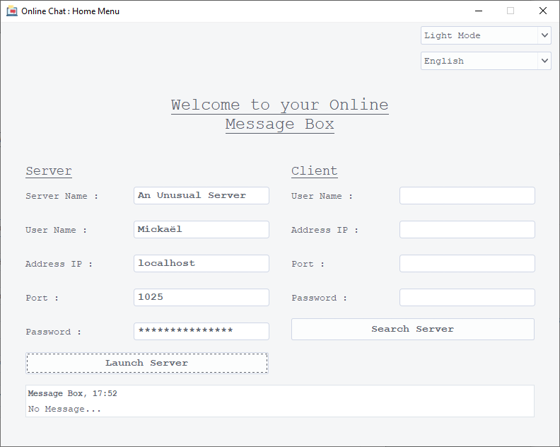
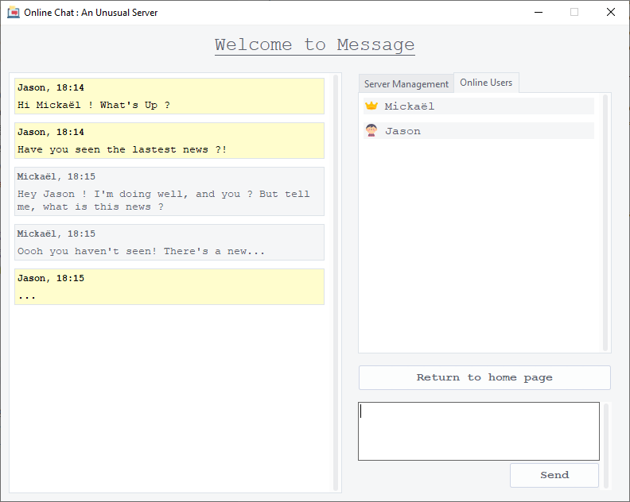

# Online Chat Application.

## Description :
This computer application makes it possible to create a server, using an IP address and a specific port. Other users, having the IP address and the port, can connect to this server to discuss.

The server can be protected with a password that will be asked to all users who want to connect to it.

### <ins>Functionalities.</ins>
This application has a light and dark mode. The application has also been translated into English and French.

Home Page|Server Page
|:--------|--------:|
|

## Development Side :
This software was developed in Python 3 on Windows 10. The graphical user interface was made with the following libraries: Tkinter and ttkThemes.

### <ins>Packages used.</ins>
* For the GUI :
    - Tkinter
    - ttkThemes

* For the networks :
    - Select
    - Socket

* Others :
    - Datetime
    - Pickle
    - Textwrap
    - Threading

## Uses :
To use it make sure to install all the necessary Python libraries, using this command.
```
pip install -r requirements.txt
```
Then run the main.py file to open the application.
```
python main.py
```

### <ins>Creation of a server.</ins>
Once the application is open, to create a server, simply fill in the input fields in the server part. The server must be run on an IP address (e.g.: localhost) and a port (greater than 1024). Then click on "Launched Server".

The server can exclude a user and change the password.

### <ins>Connection to a server.</ins>
To connect to a server, fill in all the input fields in the client section. And enter, the IP address and the port on which the server is launched. Then click on "Search Server".

---

# Application de Messagerie en Ligne.

## Description :
Cette application d'ordinateur permet de créer un serveur, à l'aide d'une adresse IP et d'un port spécifique. D'autres utilisateurs, ayant l'adresse IP et le port, peuvent se connecter à ce serveur pour discuter.

Le serveur peut être protégé avec un mot de passe qui sera demandé à tous les utilisateurs souhaitant se connecter sur celui-ci.

### Fonctionnalitées.
Cette application possède un mode éclairé et sombre. L'application a également été traduite en Anglais et en Français.

## Côté développement :
Ce logiciel a été développé en Python 3 sur Windows 10. L'interface graphique a été faites avec les libraries suivantes : Tkinter et ttkthemes.

### Libraries Utilisées.
* Pour les GUI :
    - Tkinter
    - ttkThemes

* Pour les réseaux :
    - Select
    - Socket

* Autres :
    - Datetime
    - Pickle
    - Textwrap
    - Threading


## Usage :
Pour l'utiliser veiller à installer toutes les librairies Python nécessaires, à l'aide de cette commande.
```
pip install -r requirements.txt
```
Puis exécuter le fichier main.py pour ouvrir l'application.
```
python main.py
```

### Création d'un serveur.
Une fois l'application ouverte, pour créer un serveur il suffit de remplir les champs de saisie dans la partie serveur. Le serveur doit être lancer sur une adresse IP (ex: localhost) et un sur port (supérieur à 1024). Puis cliquez sur "Launched Server".

Le propriétaire du serveur peut exclure un utilisateur et changer le mot de passe.

### Connection à un serveur.
Pour se connecter à un serveur, remplissez tous les champs de saisie dans la partie client. Et entrez, l'adresse IP et le port sur lequel le serveur est lancé. Puis cliquez sur "Search Server".

-----

